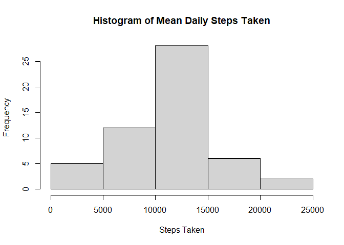
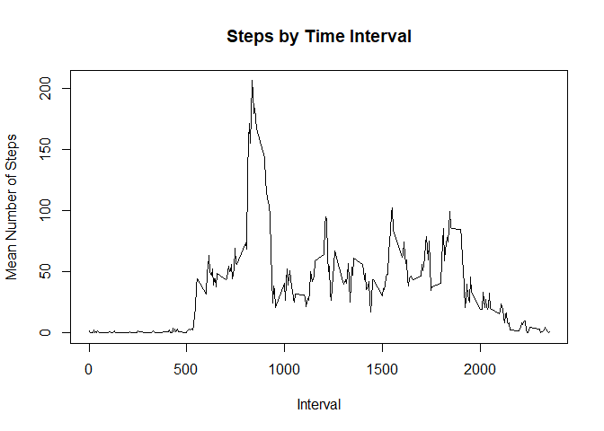
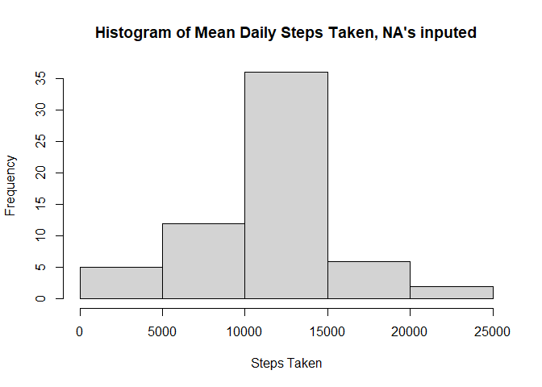
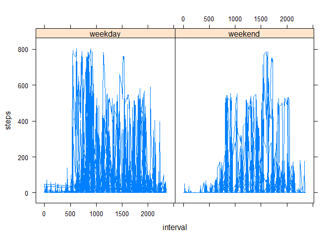

## Loading and preprocessing the data

```r
# Reading Data and converting Character dates to date objects
data <- read.csv('activity.csv',header = TRUE)
data$date <- as.Date(data$date,'%Y-%m-%d')
```


## What is mean total number of steps taken per day?

```r
## Making Histogram
dates <- unique(data$date)
count <- 0
dailyMeans <- 0
for (x in dates){
      count = count + 1
      today <- subset(data,date == x)
      dailyMeans[count] <- sum(today$steps)
}
hist(dailyMeans,main = "Histogram of Mean Daily Steps Taken",xlab = 'Steps Taken')
```

<!-- -->


```r
## Reporting Mean
mean(dailyMeans,na.rm = TRUE)
```

```
## [1] 10766.19
```


```r
## Reporting Median
median(dailyMeans,na.rm = TRUE)
```

```
## [1] 10765
```
## What is the average daily activity pattern?

```r
#Plotting Daily Activity
times <- unique(data$interval)
count <- 0
stepsByTime <- 0
for (x in times){
      count = count + 1
      currentTime <- subset(data,interval == x)
      stepsByTime[count] <- mean(currentTime$steps,na.rm = TRUE)
}
plot(times,stepsByTime,type = 'l',xlab = 'Interval',ylab = 'Mean Number of Steps',main = 'Steps by Time Interval')
```

<!-- -->


```r
## Finding Time of max average steps
maxIndex <- which(stepsByTime == max(stepsByTime))
times[maxIndex]
```

```
## [1] 835
```
As you can see from the plot and the output of the code, the time interval with the most average steps is 8:35AM

## Imputing missing values

```r
## Number of missing values
sum(is.na(data$steps))
```

```
## [1] 2304
```
The code above shows that the number of missing values is 2304. To fill in these values, we will use the mean for that time interval to replace the values. This is shown in the code below.

```r
dataNew <- data
index <- 0
for (x in dataNew$steps){
      index = index + 1
      if (is.na(x)){
            dataNew$steps[index] = stepsByTime[which(dataNew$interval[index] == times)]
      }
}
```


```r
## Making Histogram
dates <- unique(dataNew$date)
count <- 0
dailyMeans <- 0
for (x in dates){
      count = count + 1
      today <- subset(dataNew,date == x)
      dailyMeans[count] <- sum(today$steps)
}
hist(dailyMeans,main = "Histogram of Mean Daily Steps Taken, NA's inputed",xlab = 'Steps Taken')
```

<!-- -->


```r
## Reporting Mean
mean(dailyMeans,na.rm = TRUE)
```

```
## [1] 10766.19
```


```r
## Reporting Median
median(dailyMeans,na.rm = TRUE)
```

```
## [1] 10766.19
```

As you can see, imputing the NA values altered the results slightly. The mean remains the same as before and the median has shifted to equal the mean.

## Are there differences in activity patterns between weekdays and weekends?

```r
weekday <- character(0)
index <- 0
days <- weekdays(dataNew$date)
for(x in days){
      index = index + 1
      if (days[index] == 'Saturday' | days[index] == 'Sunday'){
            weekday <- c(weekday,'weekend')
      }
      else{
            weekday <- c(weekday,'weekday')
      }
}
dataNew = cbind(dataNew,weekday)
```


```r
library(lattice)
xyplot(steps~interval | weekday, data = dataNew,type = 'l',horizontal = FALSE)
```

<!-- -->
